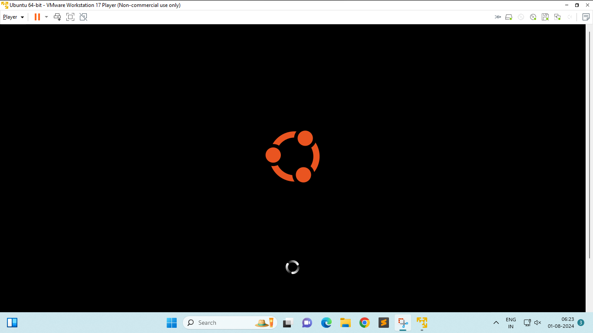
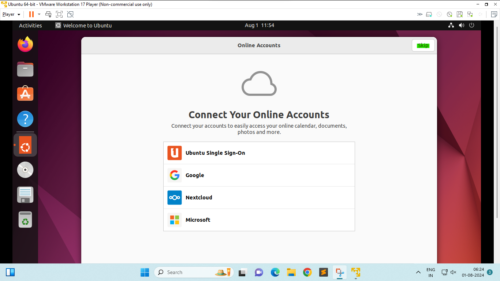

# Installing linux on vm ware
## Assignment 1
Download unbuntu iso

Click create Virtual Machine

Browse for the iso file

Enter creads

Wait for the machine to restart

Follow the inscructions to finish the installation

Click Done to finish the installation

Click ctrl+alt+t to launch terminal

Type sudo apt update and sudo apt upgrade to update your systems

Click on shut down geust to close the vm

Open vm ware

Right Click on the machine that you just created and select Delete from disk to remove the vm

==========End==========
