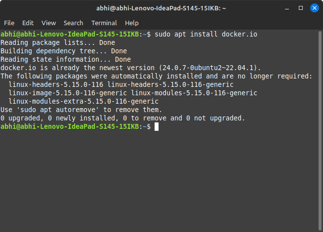
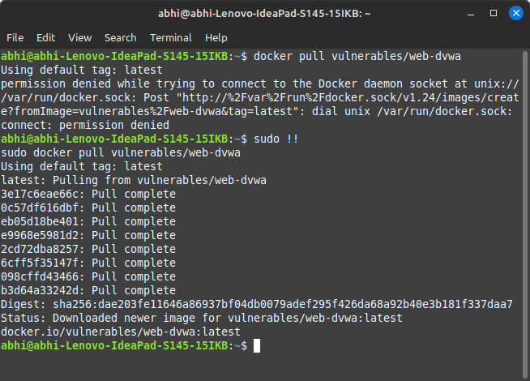
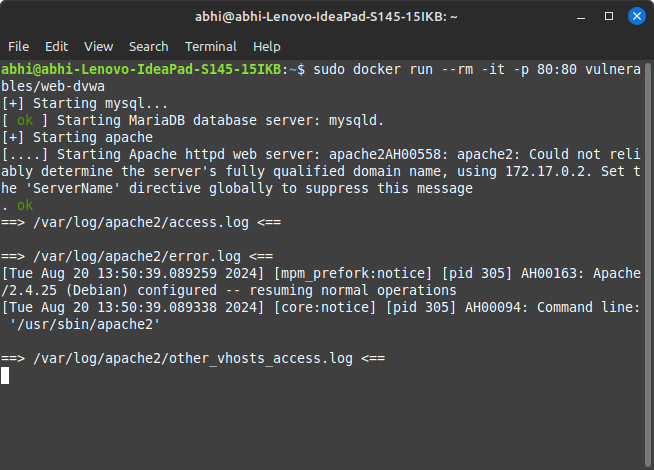
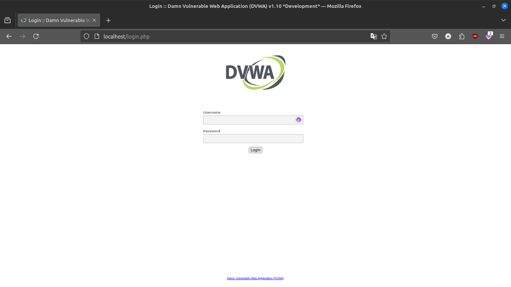
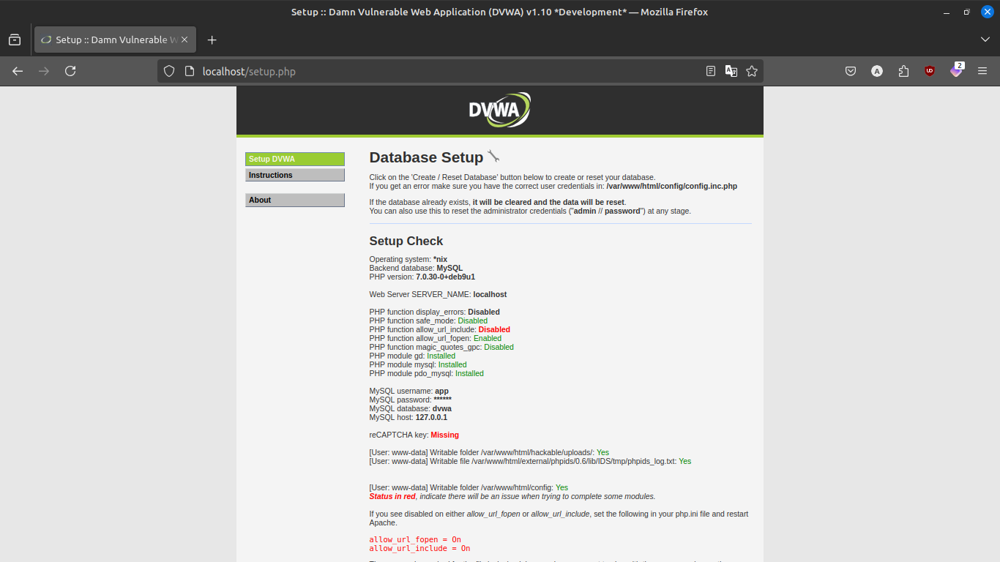
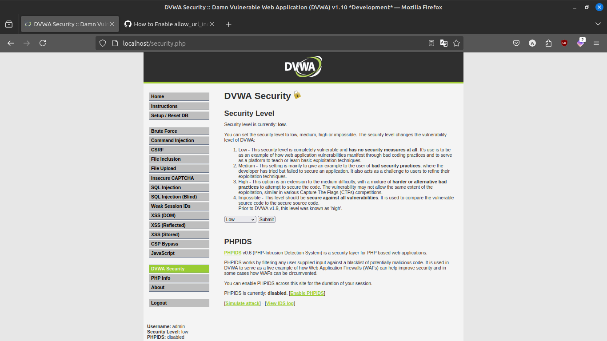

# How to install dvwa on docker
## Assignment 10

### Installing docker

### Pulling dvwa

### Running the dvwa container

### Visiting the website

### Loging into dvwa

### Click Setup/Reset database button

### The installation is completed
