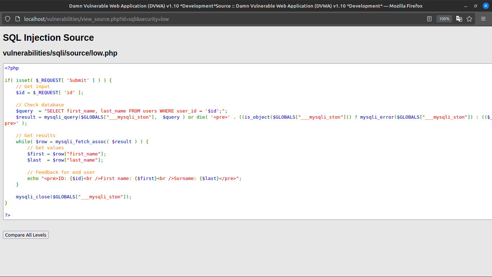
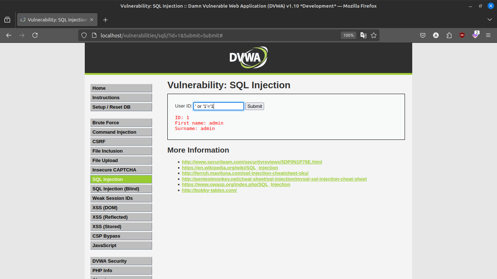
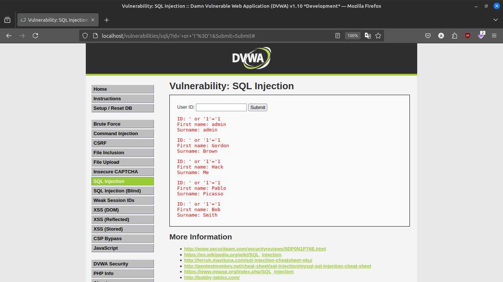
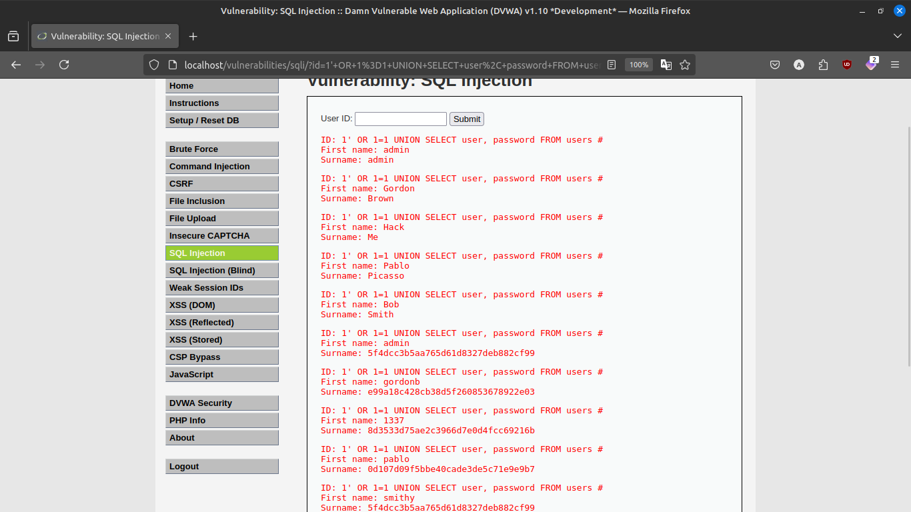
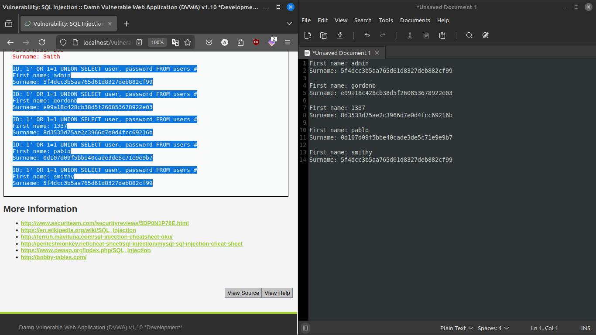
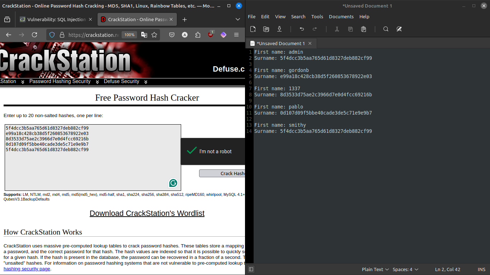
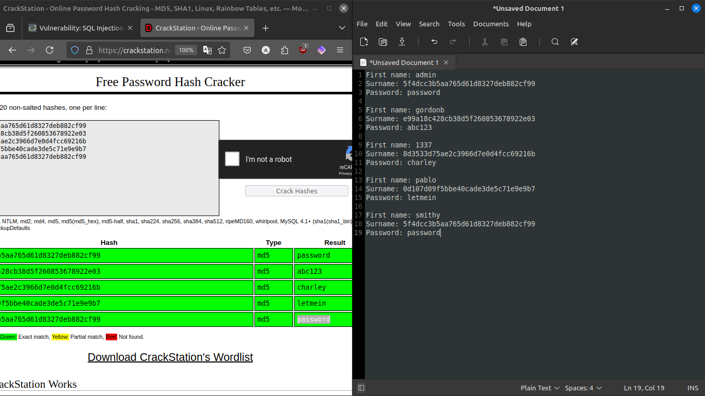

# SQLi (low)
## Assigment 11

### There is a user input to find the username and password of the id

### Viewing the code

### Injection sql code `' or '1'='1'`

### Injection sql code `1' OR 1=1 UNION SELECT user, password FROM users #`

### Extracting the MD5 hashes

### Cracking the hashes

