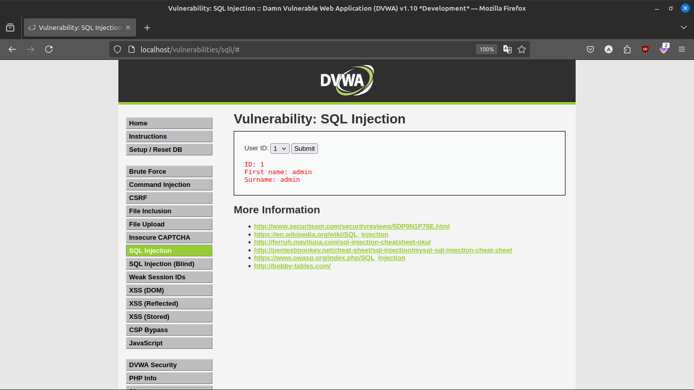
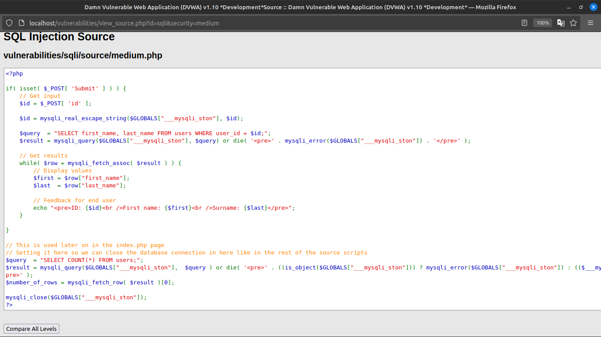
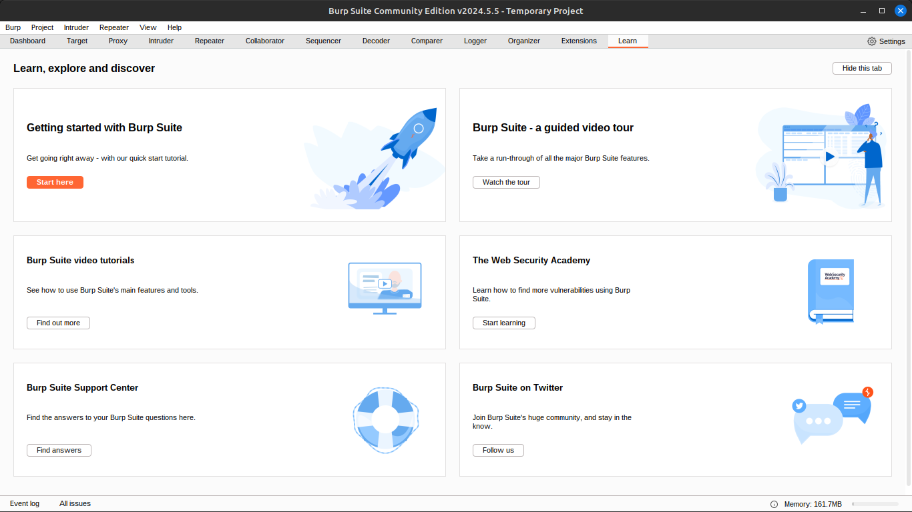
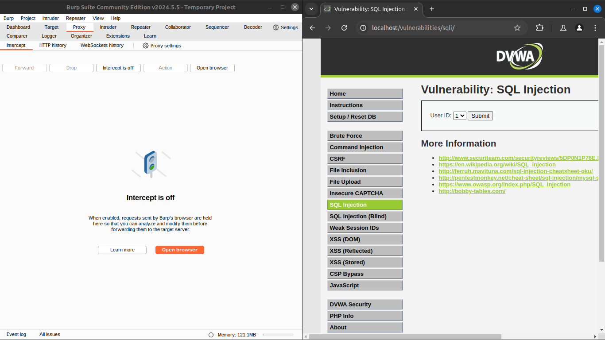
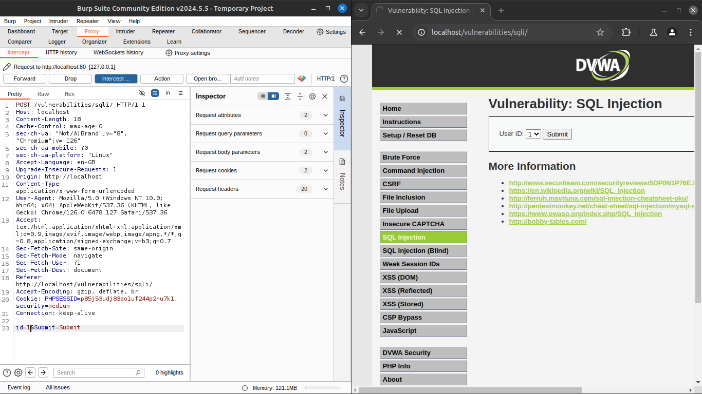
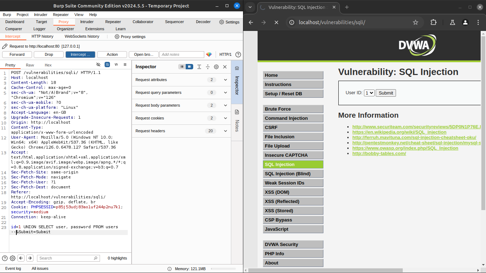
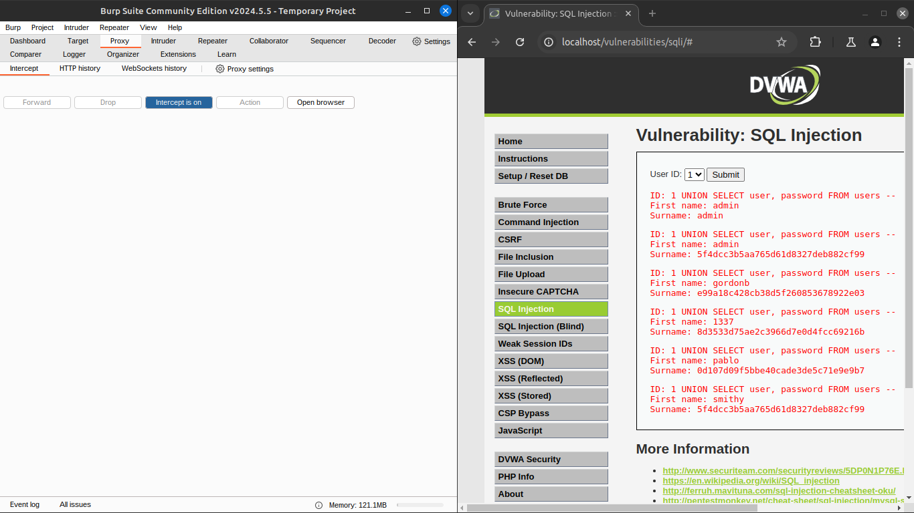

# SQLi (medium)
## Assigment 12

### In this case there is a option to avoid user input

### Viewing the code

### Starting burp suit to intrsept the http request

### Turning on the intersept and sending the request

### Examining the intersepted packet

### Adding the sql injection into it `UNION SELECT user, password FROM users --` id feild

### Forwarding the packet and receving the hashed password
