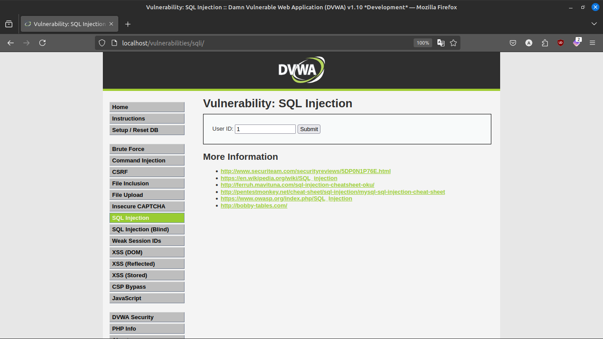
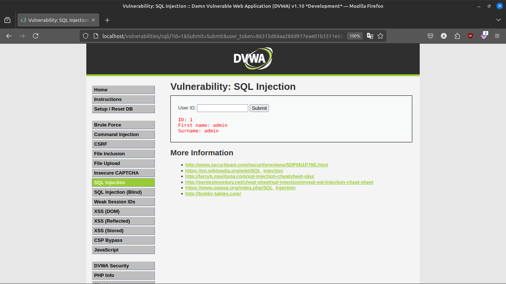
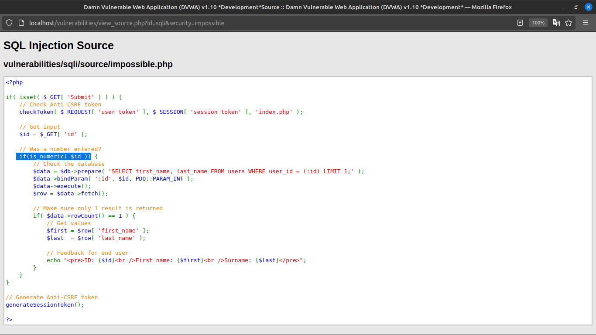
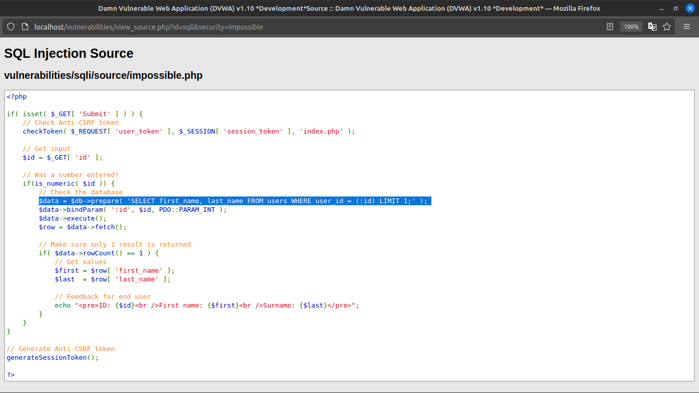
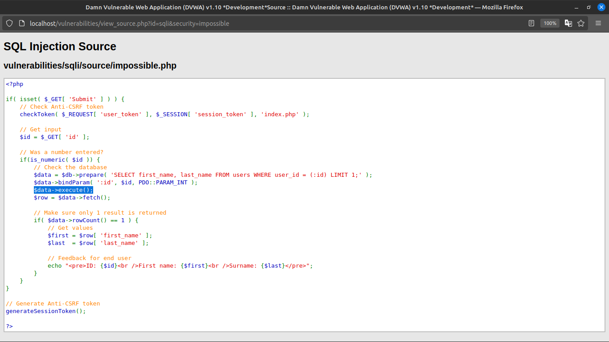

# SQLi (impossiable)
## Assigment 14

### How to mitigate SQLi 
### This time there is a input feild and it returns the data

### Viewing the code
#### Checking if the input is number

#### Passing the user input as a prepared statement

#### Then it is executed

#### This is the best way to mitigate sqli

### Summary
The best way to mitigate sqli is to use prepared statment and input sanatition.
