# Vim Commands
## Assignment 2
Creating a file in vim
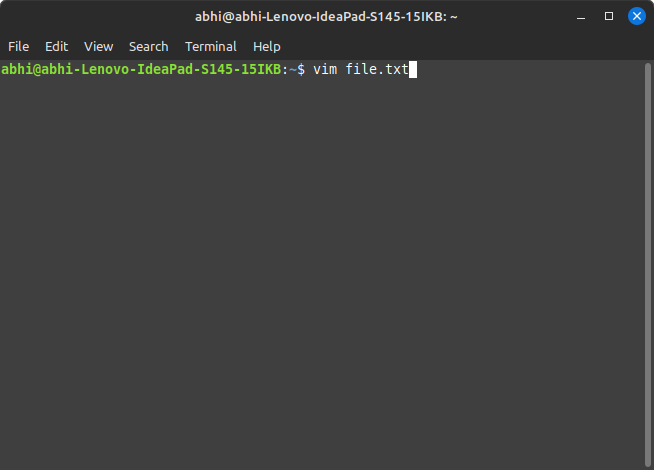
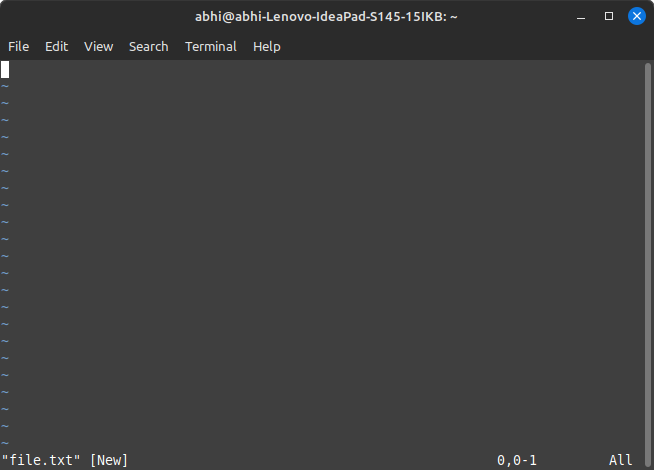
Entering insert mode by pressing i
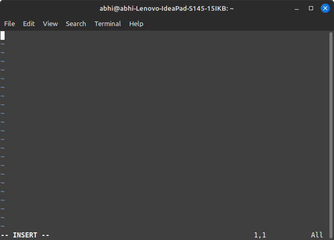
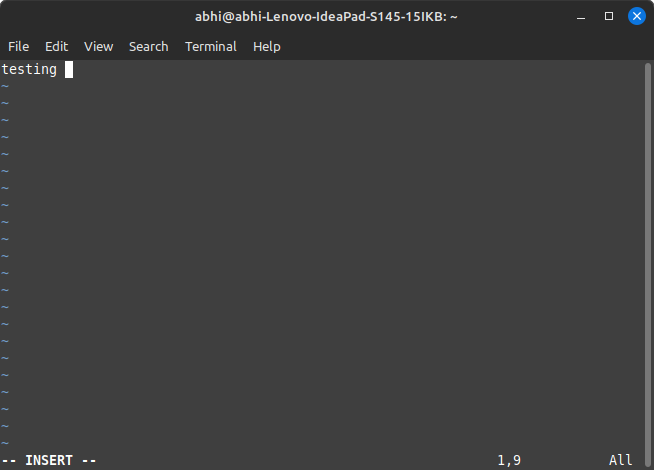
`:w` is used to write to as file

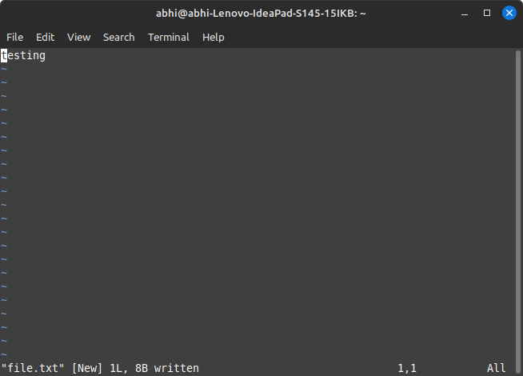
`:wq` is used to write and quit the file
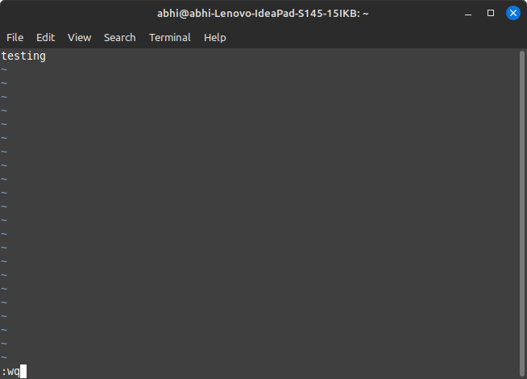
`:q!` is used to quit without saving or force quiting
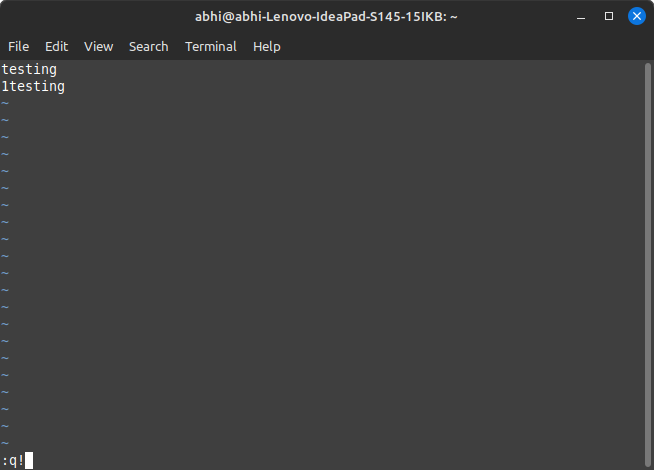
`:![commands]` is to run bash commands
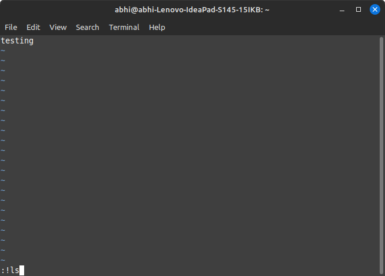
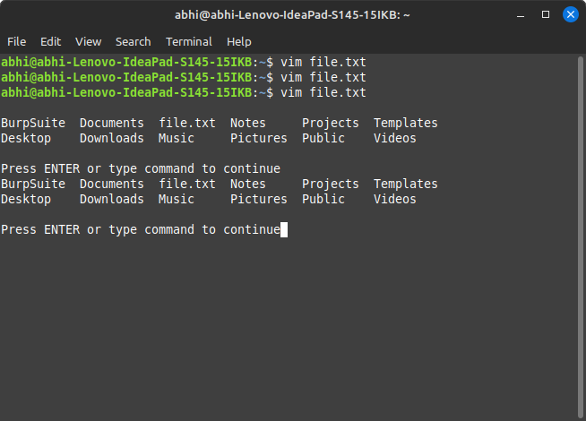
`[x],[y]d` is used to delete lines x to y
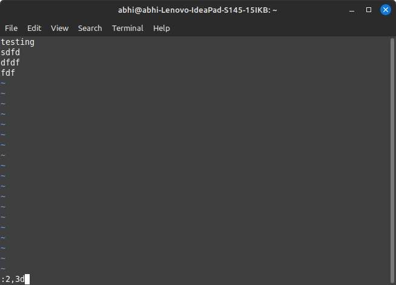
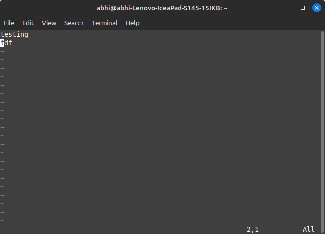
`/[exp]` is used search forward for exp
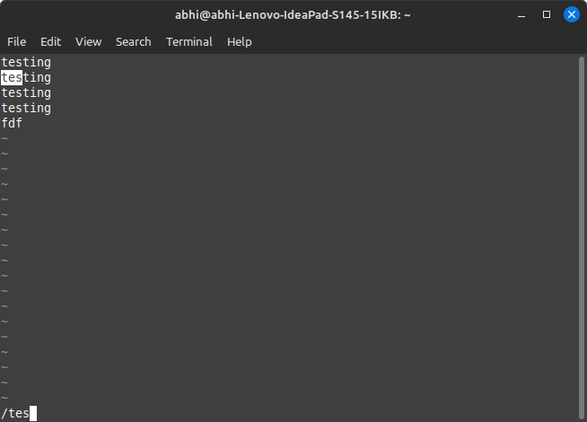
`?[exp]` is used search backword for exp
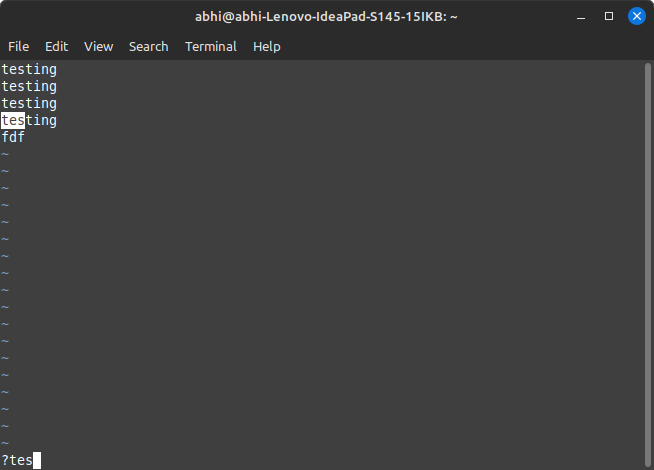
`[x]m[y]` is used to move the x line to the y line
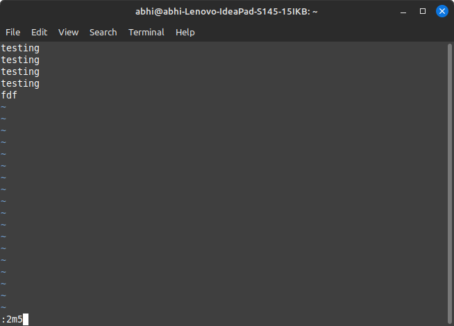
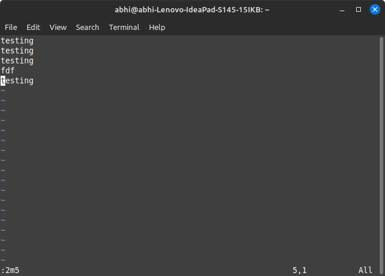