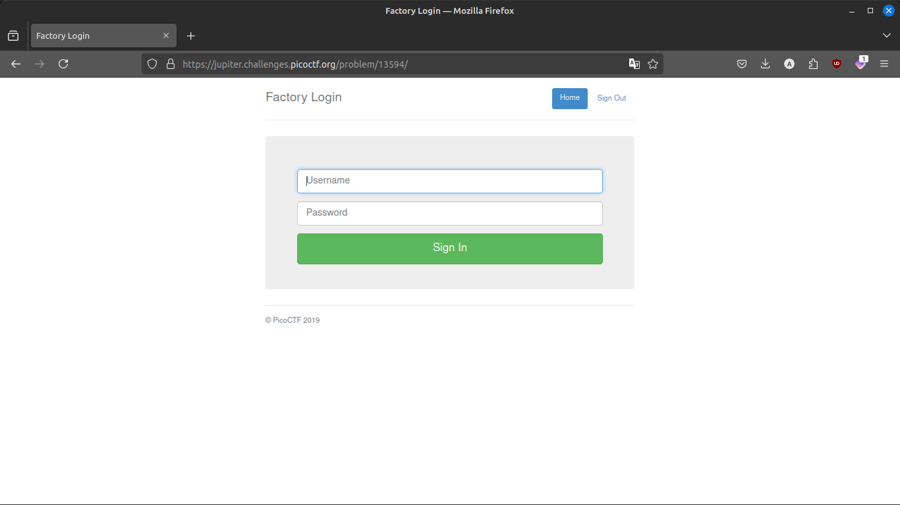
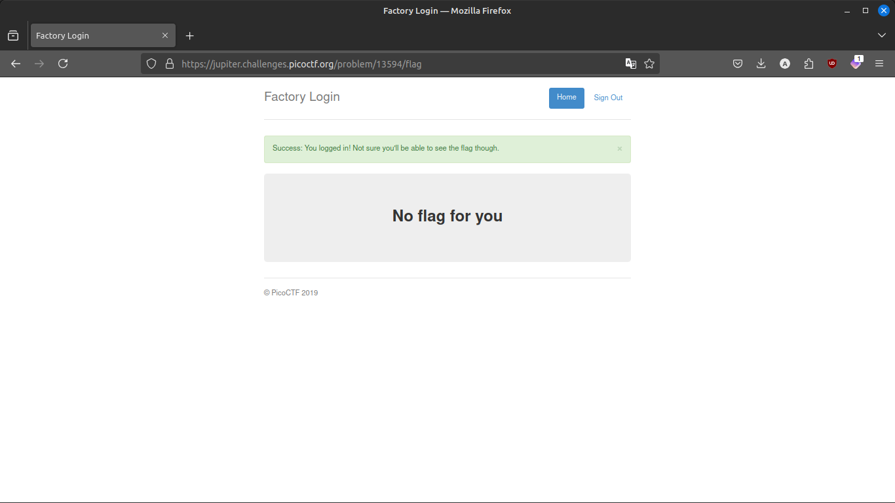
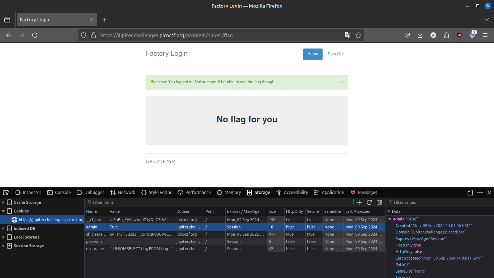
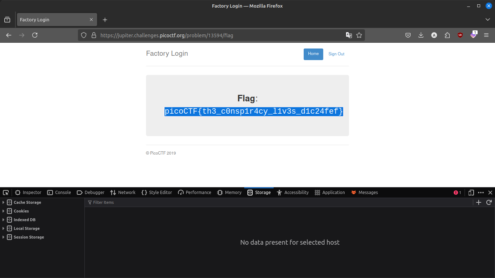

# 13 (pico ctf)
## Cryptography can be easy, do you know what ROT13 is? cvpbPGS{abg_gbb_onq_bs_n_ceboyrz}

link : https://play.picoctf.org/practice/challenge/62

```
cvpbPGS{abg_gbb_onq_bs_n_ceboyrz}

```

```
picoCTF{not_too_bad_of_a_problem}
```

# logon (pico ctf)
## The factory is hiding things from all of its users. Can you login as Joe and find what they've been looking at? https://jupiter.challenges.picoctf.org/problem/13594/ (link) or http://jupiter.challenges.picoctf.org:13594

link : https://play.picoctf.org/practice/challenge/46






```bash
picoCTF{th3_c0nsp1r4cy_l1v3s_d1c24fef}
```

