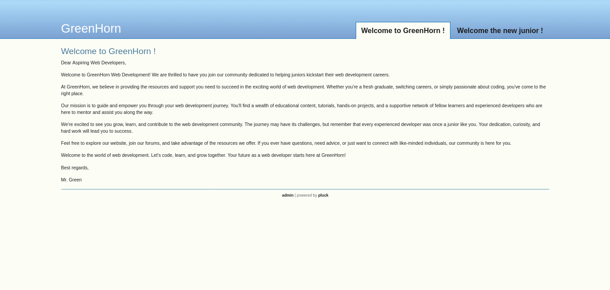
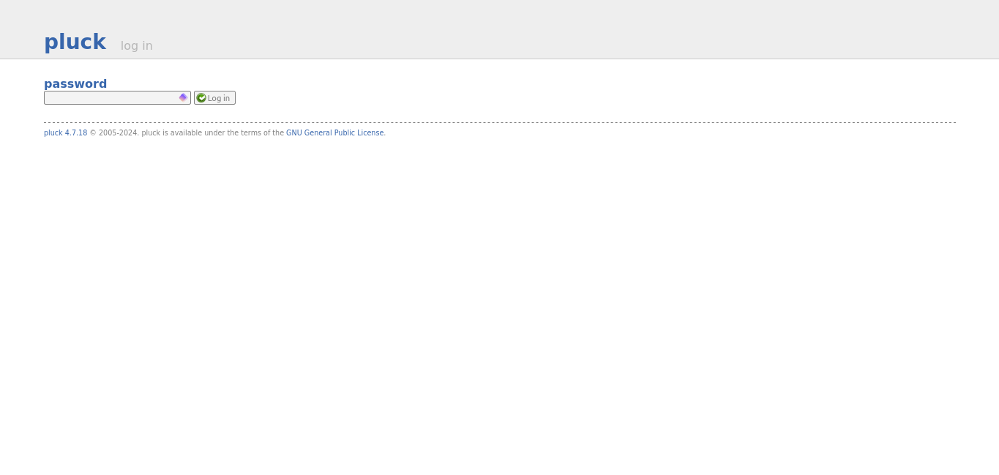
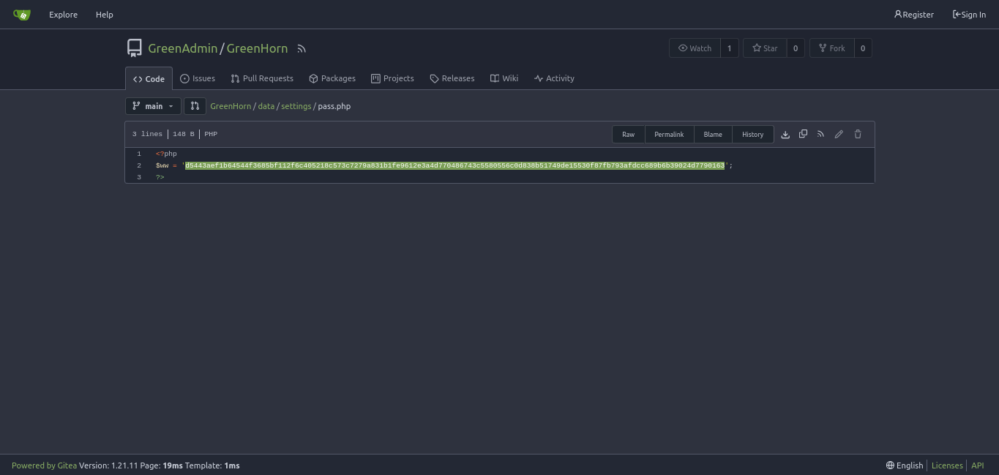
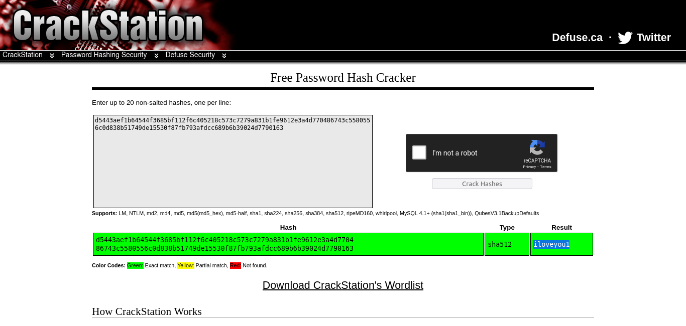
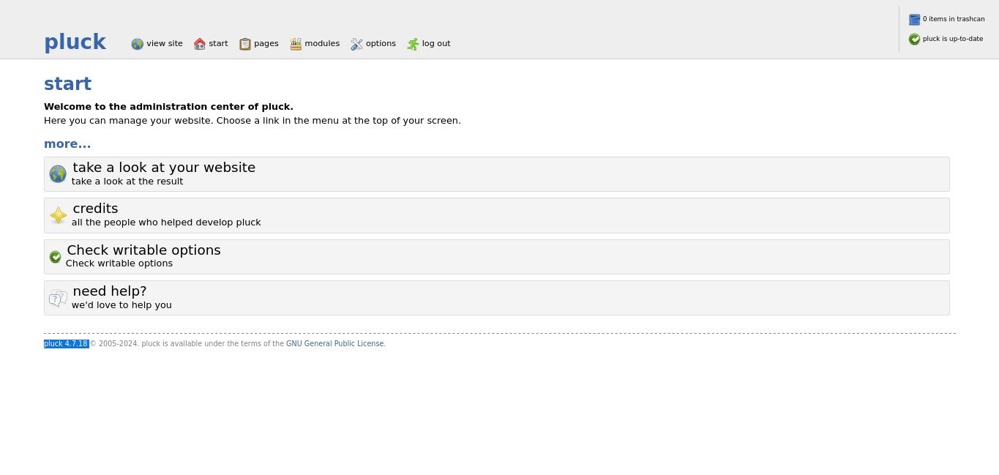

# GreenHorn (hackthebox)

## Nmap Scan

```bash
abhi@abhi-Lenovo-IdeaPad-S145-15IKB:~$ nmap -A -T4 10.10.11.25
Starting Nmap 7.80 ( https://nmap.org ) at 2024-10-11 02:40 IST
Nmap scan report for 10.10.11.25
Host is up (0.19s latency).
Not shown: 997 closed ports
PORT     STATE SERVICE VERSION
22/tcp   open  ssh     OpenSSH 8.9p1 Ubuntu 3ubuntu0.10 (Ubuntu Linux; protocol 2.0)
80/tcp   open  http    nginx 1.18.0 (Ubuntu)
|_http-server-header: nginx/1.18.0 (Ubuntu)
|_http-title: Did not follow redirect to http://greenhorn.htb/
|_https-redirect: ERROR: Script execution failed (use -d to debug)
3000/tcp open  ppp?
| fingerprint-strings: 
|   GenericLines, Help, RTSPRequest: 
|     HTTP/1.1 400 Bad Request
|     Content-Type: text/plain; charset=utf-8
|     Connection: close
|     Request
|   GetRequest: 
|     HTTP/1.0 200 OK
|     Cache-Control: max-age=0, private, must-revalidate, no-transform
|     Content-Type: text/html; charset=utf-8
|     Set-Cookie: i_like_gitea=e168dc227e9a4ee7; Path=/; HttpOnly; SameSite=Lax
|     Set-Cookie: _csrf=O5Psqmeqy_XNgq_BME1M_Naro5s6MTcyODU5MzkzOTM2NDcxNDQ2MQ; Path=/; Max-Age=86400; HttpOnly; SameSite=Lax
|     X-Frame-Options: SAMEORIGIN
|     Date: Thu, 10 Oct 2024 20:58:59 GMT
|     <!DOCTYPE html>
|     <html lang="en-US" class="theme-auto">
|     <head>
|     <meta name="viewport" content="width=device-width, initial-scale=1">
|     <title>GreenHorn</title>
|     <link rel="manifest" href="data:application/json;base64,eyJuYW1lIjoiR3JlZW5Ib3JuIiwic2hvcnRfbmFtZSI6IkdyZWVuSG9ybiIsInN0YXJ0X3VybCI6Imh0dHA6Ly9ncmVlbmhvcm4uaHRiOjMwMDAvIiwiaWNvbnMiOlt7InNyYyI6Imh0dHA6Ly9ncmVlbmhvcm4uaHRiOjMwMDAvYXNzZXRzL2ltZy9sb2dvLnBuZyIsInR5cGUiOiJpbWFnZS9wbmciLCJzaXplcyI6IjUxMng1MTIifSx7InNyYyI6Imh0dHA6Ly9ncmVlbmhvcm4uaHRiOjMwMDAvYX
|   HTTPOptions: 
|     HTTP/1.0 405 Method Not Allowed
|     Allow: HEAD
|     Allow: HEAD
|     Allow: GET
|     Cache-Control: max-age=0, private, must-revalidate, no-transform
|     Set-Cookie: i_like_gitea=4e3601ee80d7fe30; Path=/; HttpOnly; SameSite=Lax
|     Set-Cookie: _csrf=VaM57m9tGwOtCGF8iUCZHBSAcbU6MTcyODU5Mzk0NTk4NTg1OTgwNQ; Path=/; Max-Age=86400; HttpOnly; SameSite=Lax
|     X-Frame-Options: SAMEORIGIN
|     Date: Thu, 10 Oct 2024 20:59:05 GMT
|_    Content-Length: 0
```

## Editing the Host file

adding ```10.10.11.25 greenhorn.htb``` to the host file

## Visiting the website





## Visiting the 3000 through a browser

looking through the login.php

Checking whats in pass.php

Cracking the hash found and getting 

Logining to the server and finding the version for pluck (with the password "iloveyou1")


## Searching for exploits for pluck 4.7.18

https://github.com/Rai2en/CVE-2023-50564_Pluck-v4.7.18_PoC

lets follow the instrutions 

```
1. Clone this repository:
git clone https://github.com/Rai2en/CVE-2023-50564_Pluck-v4.7.18_PoC.git
cd CVE-2023-50564_Pluck-v4.7.18_PoC

2. Replace <hostname> with the target domain name or IP address in the PoC script.

3. Create a `payload.zip` file containing `shell.php`. I recommand [pentestmonkey](https://github.com/pentestmonkey/php-reverse-shell) PHP reverse shell and replace `<your_ip>` and `<port>` fields with your IP and listening port.

4. Run the PoC script:
python exploit.py

5. You will be prompted to enter the path to the ZIP file:
ZIP file path: ./path/to/payload.zip

```

running the exploit 

```
abhi@abhi-Lenovo-IdeaPad-S145-15IKB:~/exploits/CVE-2023-50564_Pluck-v4.7.18_PoC$ python3 poc.py
ZIP file path: ./payload.zip
Login account
ZIP file download.
<html>
<head><title>504 Gateway Time-out</title></head>
<body>
<center><h1>504 Gateway Time-out</h1></center>
<hr><center>nginx/1.18.0 (Ubuntu)</center>
</body>
</html>
```

getting the reverse shell

```


```