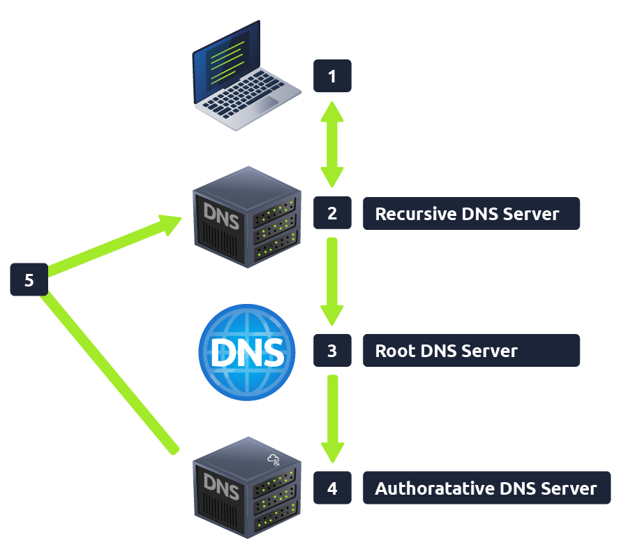
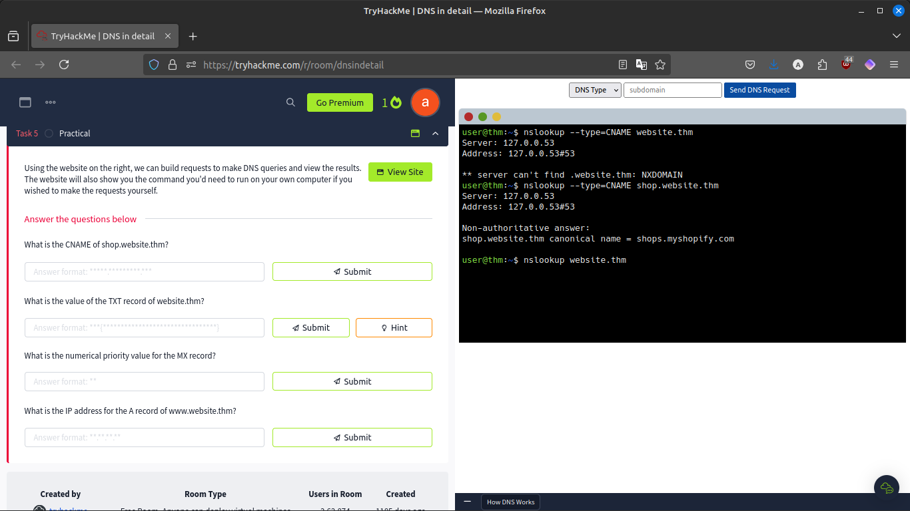
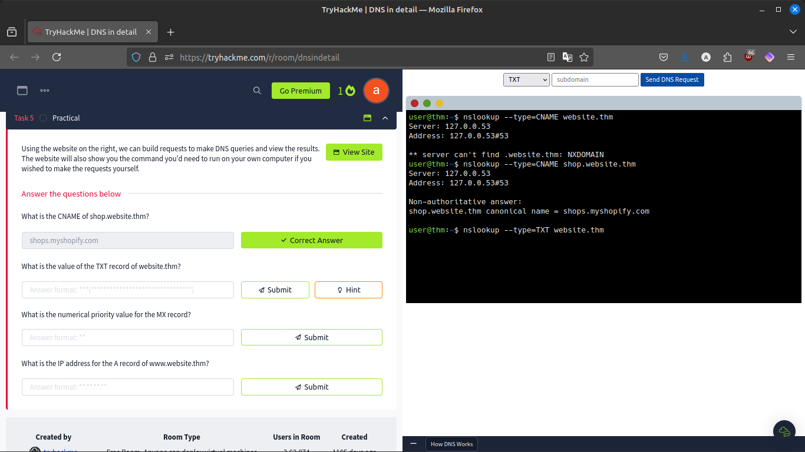
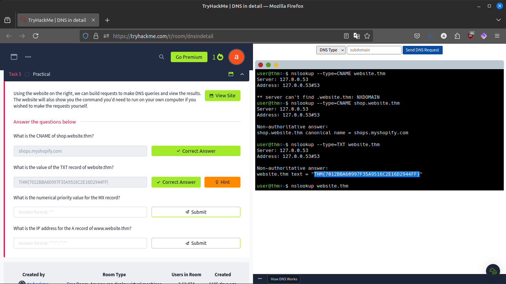
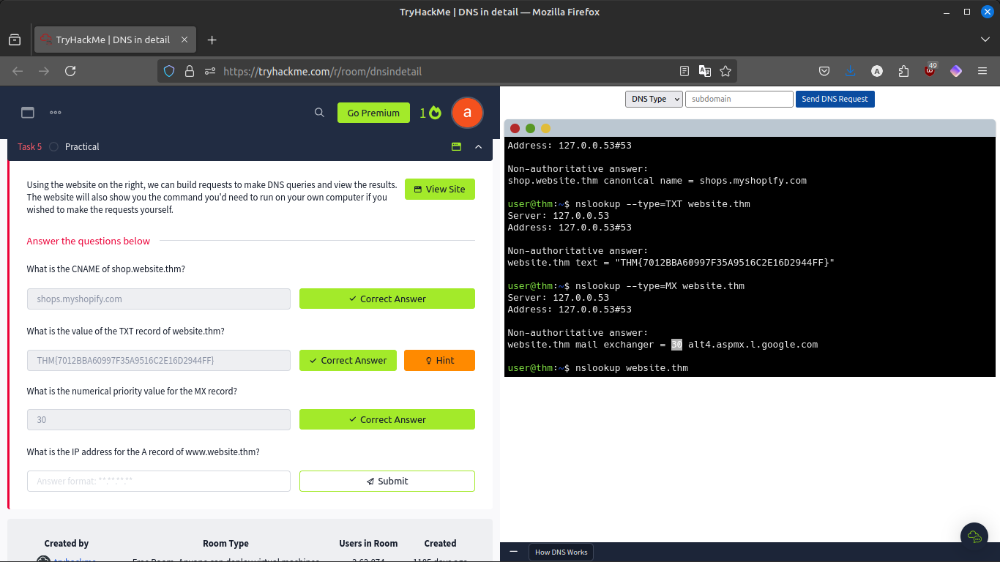
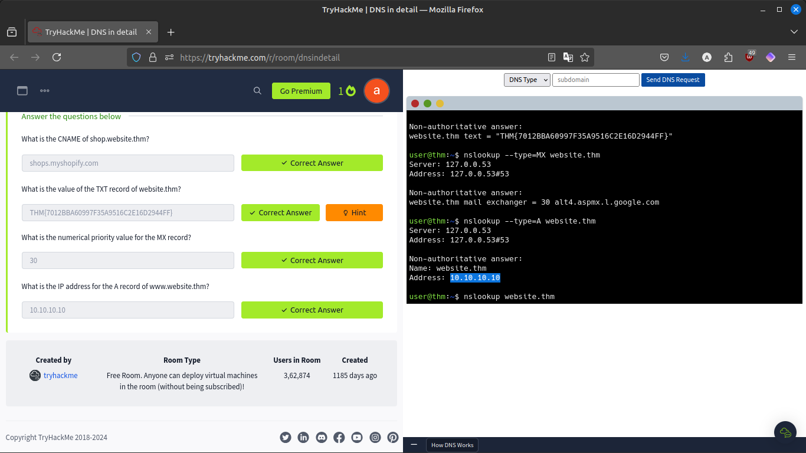
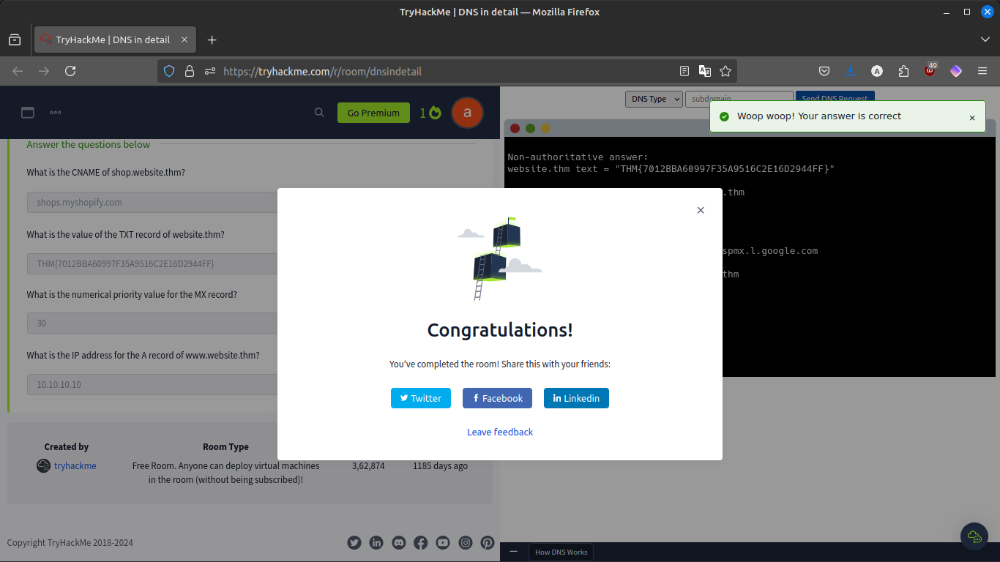

#  DNS in detail (Tryhackme)
## Assignment 5

link : https://tryhackme.com/r/room/dnsindetail

### What is DNS?
DNS (Domain Name System) provides a simple way for us to communicate with devices on the internet without remembering complex numbers. Much like every house has a unique address for sending mail directly to it, every computer on the internet has its own unique address to communicate with it called an IP address.

### Domain Hierarchy

#### TLD (Top-Level Domain)
- A TLD is the most righthand part of a domain name. So, for example, the tryhackme.com TLD is .com.
- There are two types of TLD, gTLD (Generic Top Level) and ccTLD (Country Code Top Level Domain).

#### Second-Level Domain
- Taking tryhackme.com as an example, the .com part is the TLD, and tryhackme is the Second Level Domain.

#### Subdomain
- A subdomain sits on the left-hand side of the Second-Level Domain using a period to separate it; for example, in the name admin.tryhackme.com the admin part is the subdomain.

### DNS Record Types

#### A Record

These records resolve to IPv4 addresses, for example 104.26.10.229

#### AAAA Record

These records resolve to IPv6 addresses, for example 2606:4700:20::681a:be5

#### CNAME Record

These records resolve to another domain name, for example, TryHackMe's online shop has the subdomain name store.tryhackme.com which returns a CNAME record shops.shopify.com. Another DNS request would then be made to shops.shopify.com to work out the IP address.

#### MX Record

These records resolve to the address of the servers that handle the email for the domain you are querying, for example an MX record response for tryhackme.com would look something like alt1.aspmx.l.google.com.

#### TXT Record
TXT records are free text fields where any text-based data can be stored. TXT records have multiple uses, but some common ones can be to list servers that have the authority to send an email on behalf of the domain (this can help in the battle against spam and spoofed email). They can also be used to verify ownership of the domain name when signing up for third party services.

### What happens when you make a DNS request

1. **Local Cache Check**: When you request a website, your computer first checks its own cache to see if it has recently looked up the address. If not, it asks your Recursive DNS Server.

2. **Recursive DNS Server**: This server, often provided by your ISP, checks its cache for the address. If it's not found, the server starts a search by contacting root DNS servers.

3. **Root DNS Servers**: These servers guide the request to the appropriate Top Level Domain (TLD) server based on the domain extension (like .com).

4. **TLD Servers**: They direct the request to the specific authoritative DNS server that knows the exact address of the domain.

5. **Authoritative DNS Servers**: These servers store and provide the final DNS records for the domain. The information is cached locally with a TTL (Time To Live) value to speed up future requests.

### CTF

