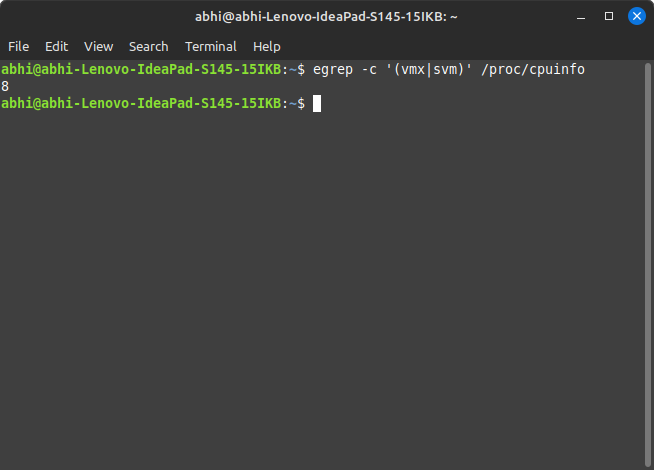
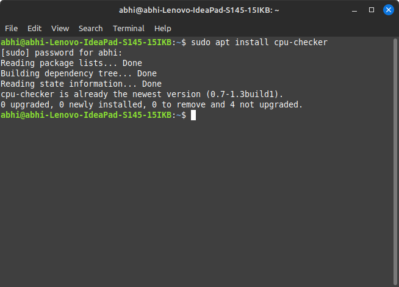
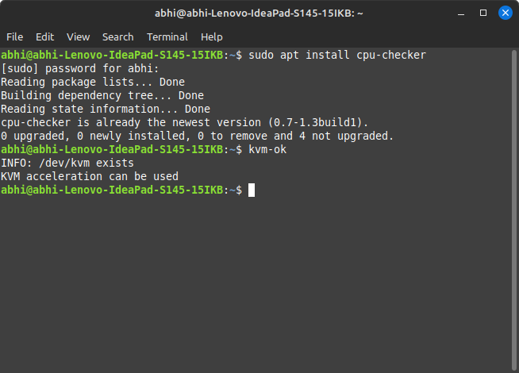
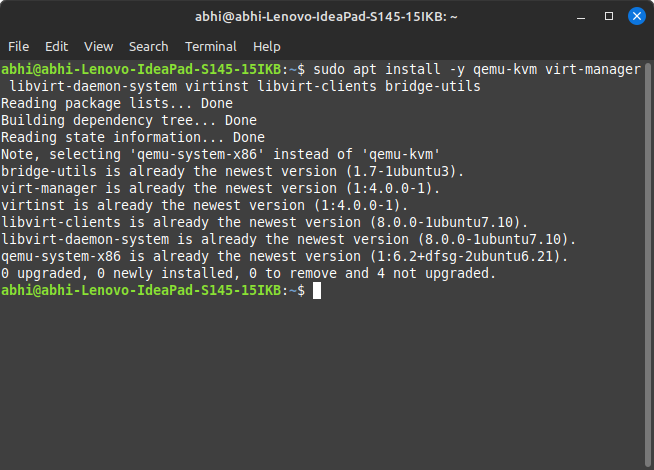
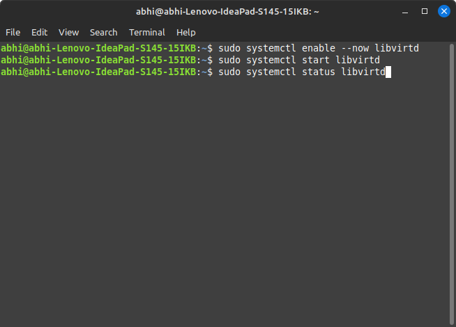
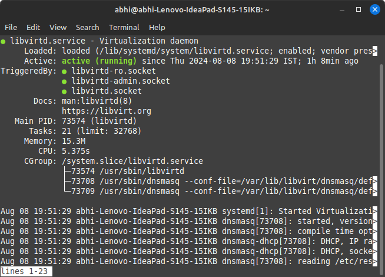
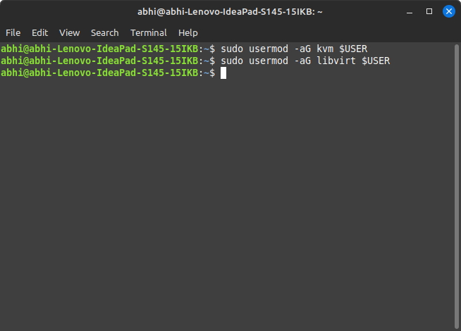
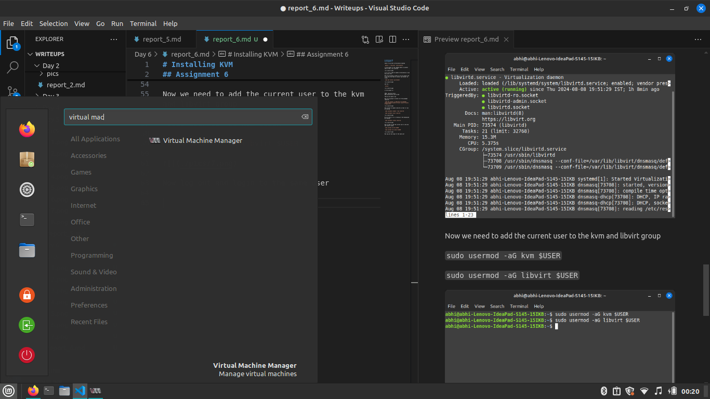

# Installing KVM
## Assignment 6

Check if you have virtulization enabled

`egrep -c '(vmx|svm)' /proc/cpuinfo`

if the output of the command above is greater then 0 then u can continue



if it is 0 u need to enable virtulitation in you bios and retry

Now we are going to check if we can install kvm
to do this you need to install cpu-checker by using:

`sudo apt install cpu-checker`



and run :

`kvm-ok`



if the output is :

```
INFO: /dev/kvm exists
KVM acceleration can be used
```
Then we are good to go

Now we are going to install all the packages required :

`sudo apt install -y qemu-kvm virt-manager libvirt-daemon-system virtinst libvirt-clients bridge-utils`



Now we have to enable libvirtd so that it runs on startup

`sudo systemctl enable --now libvirtd`

`sudo systemctl start libvirtd`



We can check if it is running in the background by running :

`sudo systemctl status libvirtd`



Now we need to add the current user to the kvm and libvirt group 

`sudo usermod -aG kvm $USER`

`sudo usermod -aG libvirt $USER`



Now log out and login to the same user and search for virtual machine manager



if it runs without any error your install was successful 


