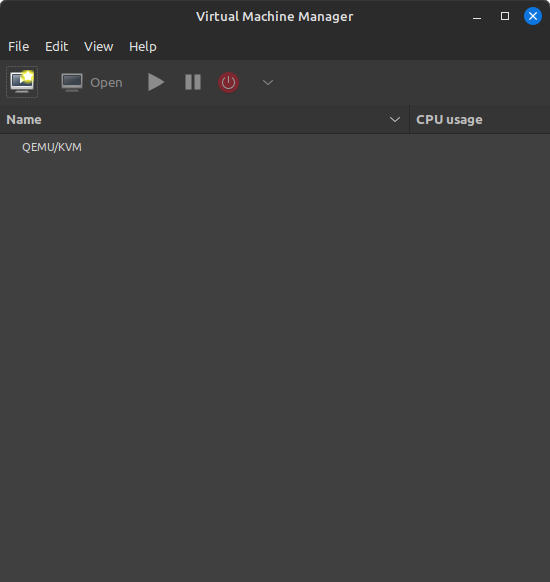
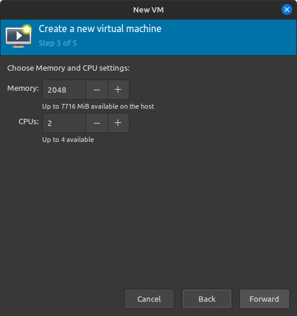

# Creating a Hacking Lab
## Assignment 6

To creating this lab we will be using kvm

To install the same follow the guide at :
https://github.com/abhinavmk00/Writeups/blob/main/Day%206/report_6.md

Open virtual machine manger

Go to edit and enable xml editing

Select local install media

Click browse

Click browse local

Select the windows .iso file

Click Forward


Select the ram and the cpu 

Now select the amount of storage

Check the Coustomize configuration

Select overview and select xml and paste the following 
```
<hyperv mode="custom">
  <relaxed state="on"/>
  <vapic state="on"/>
  <spinlocks state="on" retries="8191"/>
  <vpindex state="on"/>
  <runtime state="on"/>
  <synic state="on"/>
  <stimer state="on">
    <direct state="on"/>
  </stimer>
  <reset state="on"/>
  <vendor_id state="on" value="KVM Hv"/>
  <frequencies state="on"/>
  <reenlightenment state="on"/>
  <tlbflush state="on"/>
  <ipi state="on"/>
  <evmcs state="on"/>
</hyperv>
```


change the disk bus to virtio


Download the virtio drivers
```
$ wget https://fedorapeople.org/groups/virt/virtio-win/direct-downloads/archive-virtio/virtio-win-0.1.240-1/virtio-win-0.1.240.iso
```

Add the virtio iso to the vm


Change the nic to virtio

Remove tablet support

Change the version to 2.0

Click begin installation

Select the windows iso in the bios

Select the language and keyboard

Finish the windows install

To be continued ....