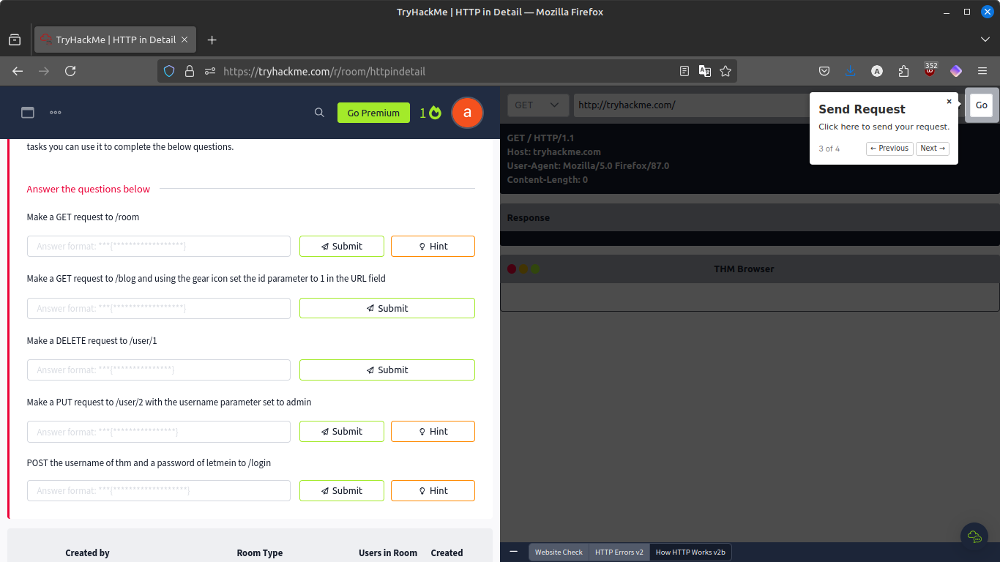

# HTTP in Detail (Tryhackme)
## Assignment 8

link : https://tryhackme.com/r/room/httpindetail

### What is HTTP? (HyperText Transfer Protocol)

HTTP is what's used whenever you view a website. HTTP is the set of rules used for communicating with web servers for the transmitting of webpage data, whether that is HTML, Images, Videos, etc.

### What is HTTPS? (HyperText Transfer Protocol Secure)
HTTPS is the secure version of HTTP. HTTPS data is encrypted so it not only stops people from seeing the data you are receiving and sending, but it also gives you assurances that you're talking to the correct web server and not something impersonating it.


### What is a URL? (Uniform Resource Locator)


**Scheme**: This instructs on what protocol to use for accessing the resource such as HTTP, HTTPS, FTP (File Transfer Protocol).

**User**: Some services require authentication to log in, you can put a username and password into the URL to log in.

**Host**: The domain name or IP address of the server you wish to access.

**Port**: The Port that you are going to connect to, usually 80 for HTTP and 443 for HTTPS, but this can be hosted on any port between 1 - 65535.

**Path**: The file name or location of the resource you are trying to access.

**Query String**: Extra bits of information that can be sent to the requested path. For example, /blog?id=1 would tell the blog path that you wish to receive the blog article with the id of 1.

**Fragment**: This is a reference to a location on the actual page requested. This is commonly used for pages with long content and can have a certain part of the page directly linked to it, so it is viewable to the user as soon as they access the page.

### Request and Response


Example Request:
```
GET / HTTP/1.1
Host: tryhackme.com
User-Agent: Mozilla/5.0 Firefox/87.0
Referer: https://tryhackme.com/
```

Example Response:
```
HTTP/1.1 200 OK
Server: nginx/1.15.8
Date: Fri, 09 Apr 2021 13:34:03 GMT
Content-Type: text/html
Content-Length: 98

<html>
<head>
    <title>TryHackMe</title>
</head>
<body>
    Welcome To TryHackMe.com
</body>
</html>
```

### HTTP Methods

**GET Request**\
This is used for getting information from a web server.

**POST Request**\
This is used for submitting data to the web server and potentially creating new records

**PUT Request**\
This is used for submitting data to a web server to update information

**DELETE Request**\
This is used for deleting information/records from a web server.

### HTTP Status Codes

* **100-199 - Information Response**\
These are sent to tell the client the first part of their request has been accepted and they should continue sending the rest of their request. These codes are no longer very common.
* **200-299 - Success**\
This range of status codes is used to tell the client their request was successful.
* **300-399 - Redirection**\
These are used to redirect the client's request to another resource. This can be either to a different webpage or a different website altogether.
* **400-499 - Client Errors**\
Used to inform the client that there was an error with their request.
* **500-599 - Server Errors**\
This is reserved for errors happening on the server-side and usually indicate quite a major problem with the server handling the request.

### Common HTTP Status Codes

200 - OK\
201 - Created\
301 - Moved Permanently\
302 - Found\
400 - Bad Request\
401 - Not Authorised\
403 - Forbidden\
405 - Method Not Allowed\
404 - Page Not Found\
500 - Internal Service Error\
503 - Service Unavailable

### Cookies


### Activity





