# How Websites Work (Tryhackme)
## Assignment 9

link:https://tryhackme.com/r/room/howwebsiteswork

There are two major components that make up a website:

* **Front End (Client-Side)** - the way your browser renders a website.
* **Back End (Server-Side)** - a server that processes your request and returns a response.

Websites are primarily created using:

* **HTML** to build websites and define their structure
* **CSS** to make websites look pretty by adding styling options
* **JavaScript** implement complex features on pages using interactivity

### HTML
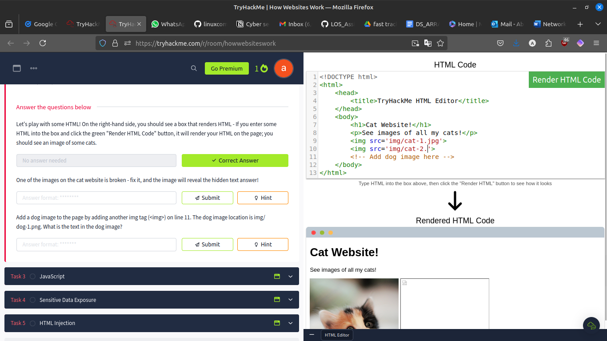
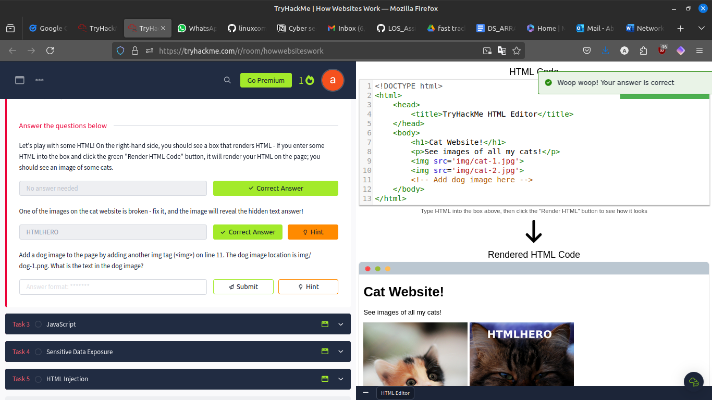
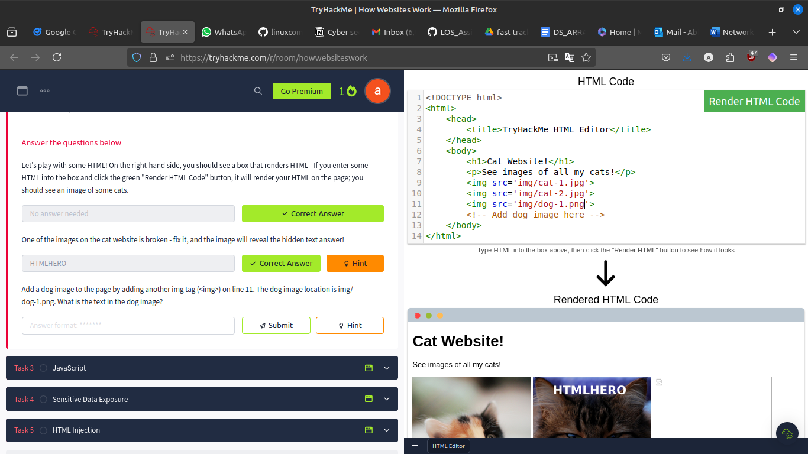
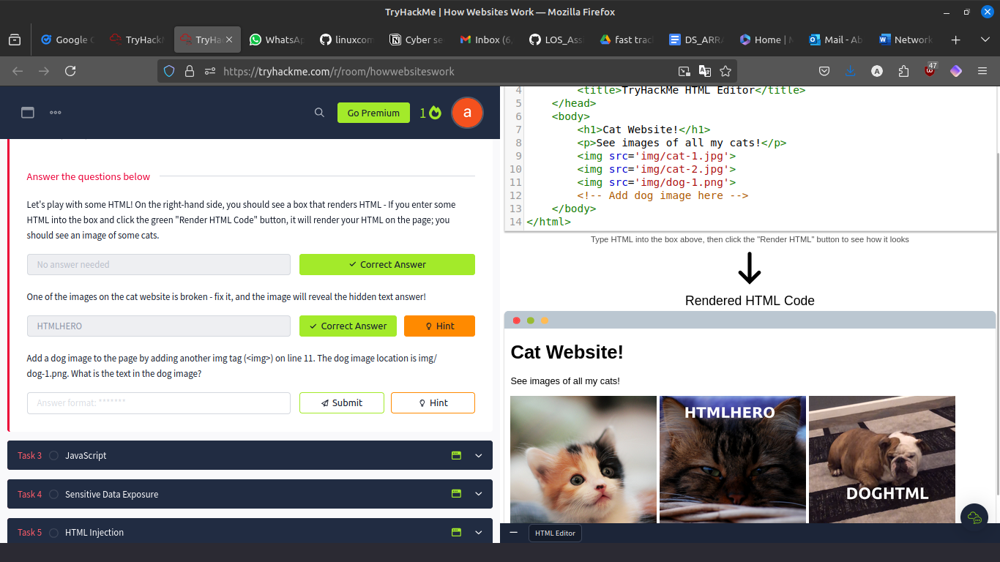
### Javascript
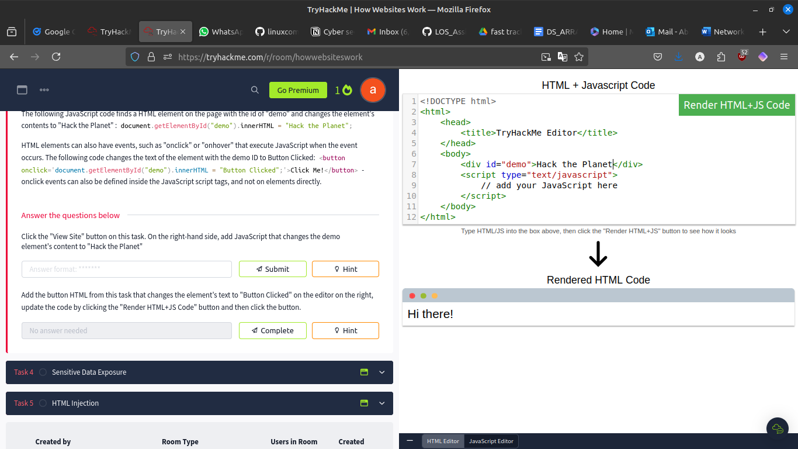
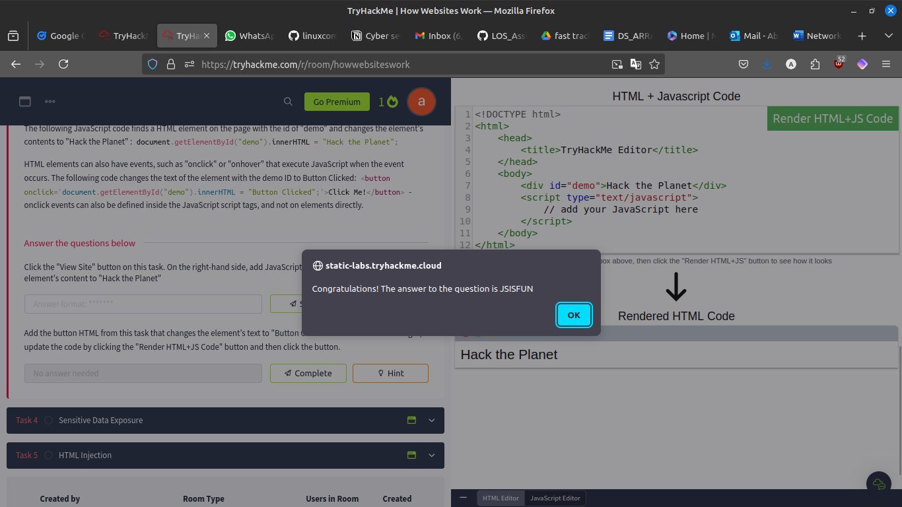
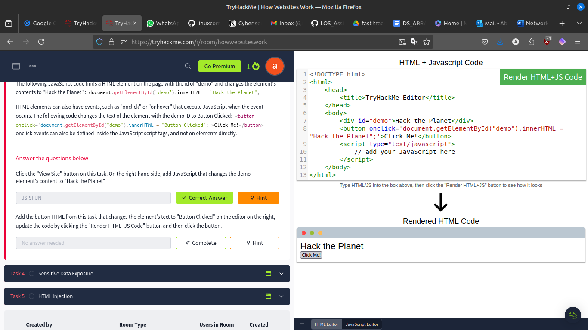
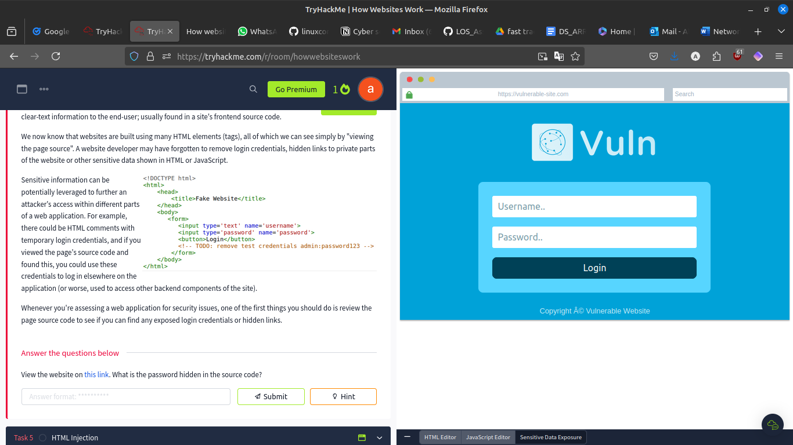
### Sensitive Data Exposure
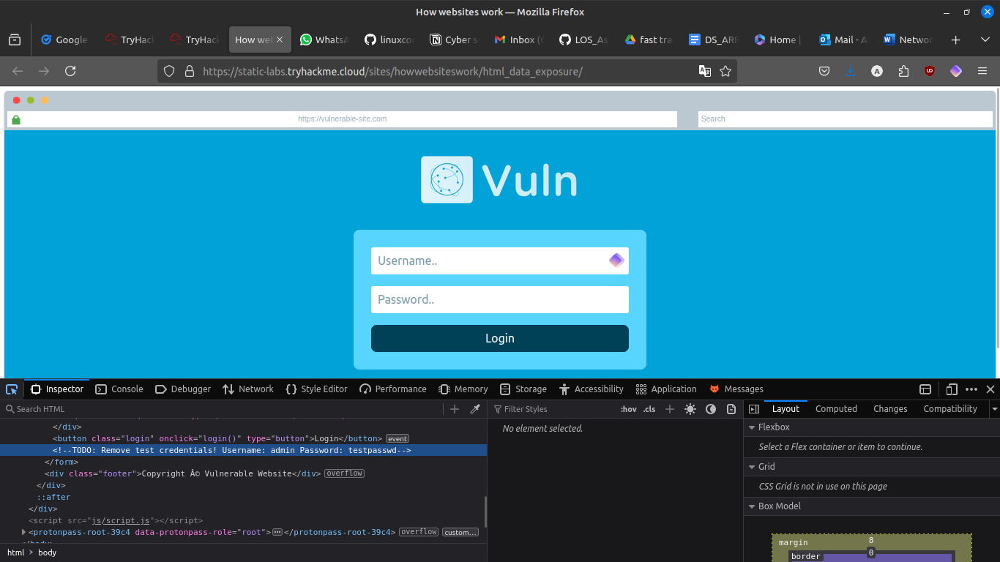
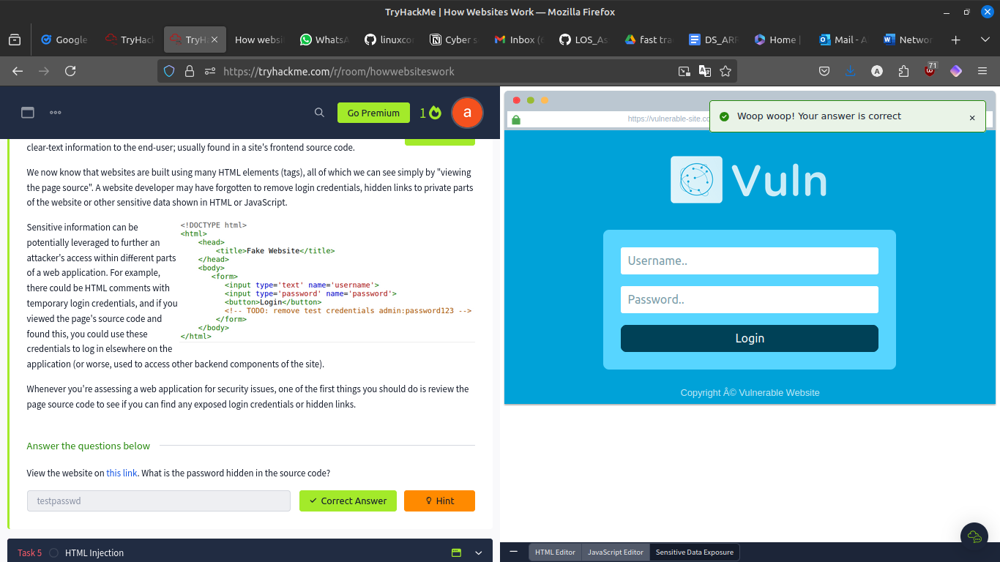
### HTML Injection
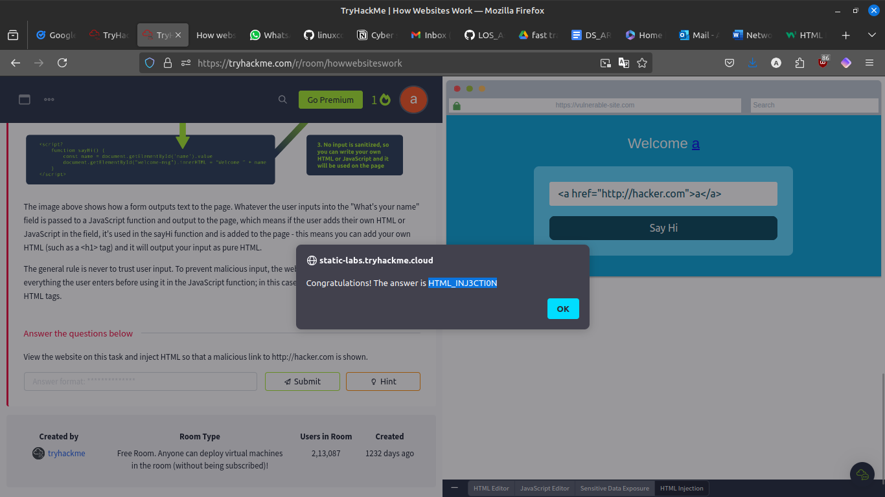
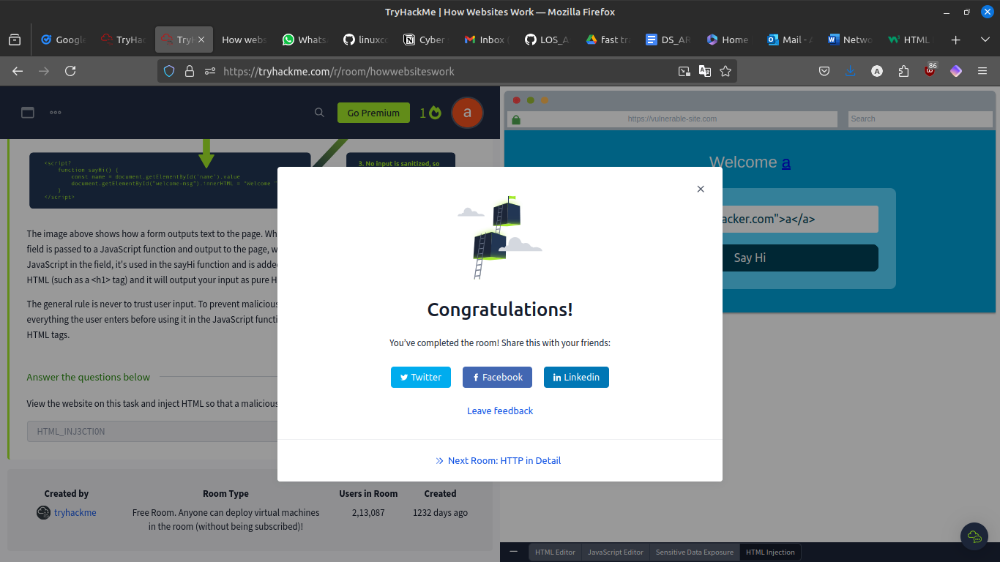

